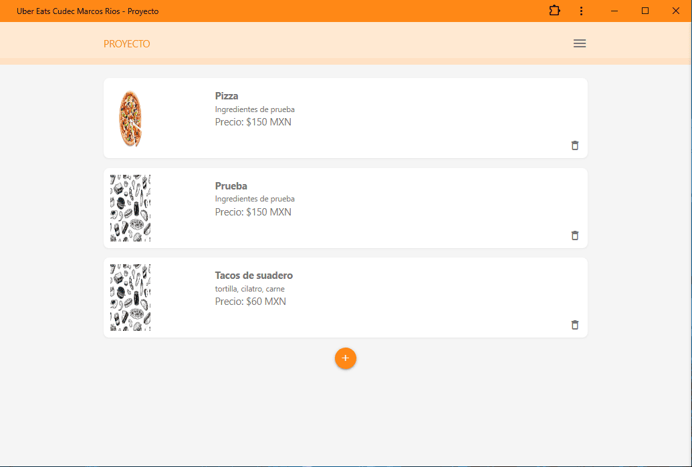
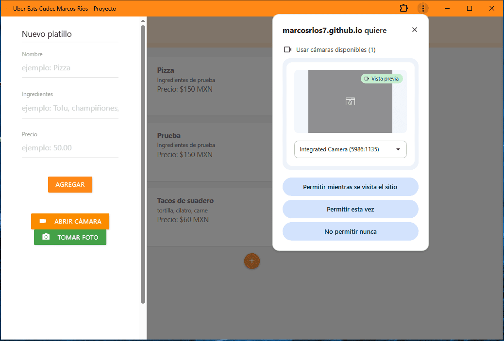
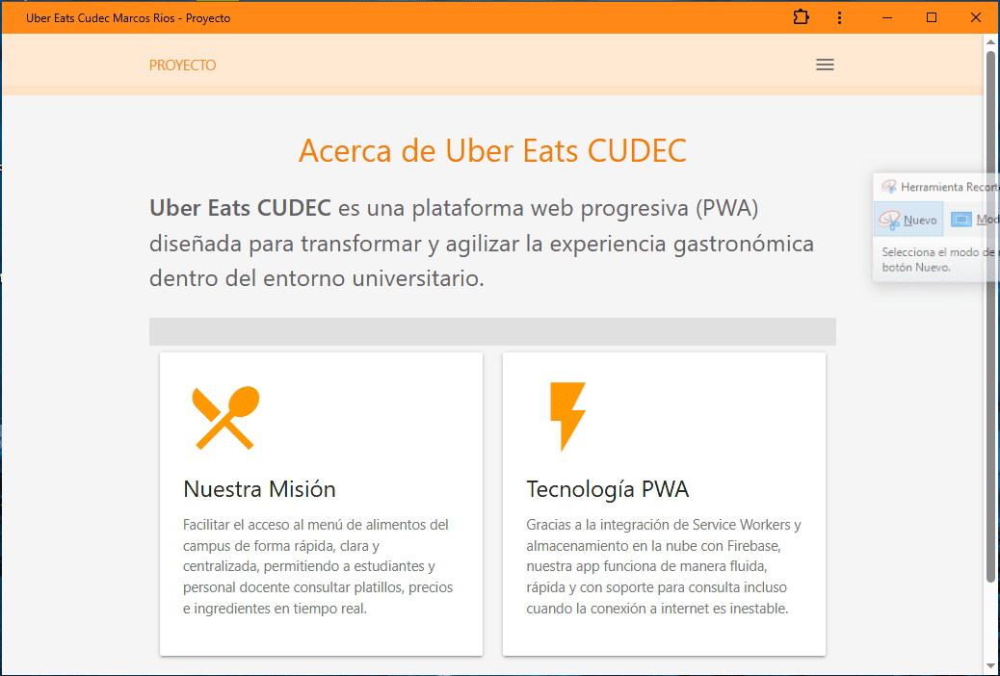
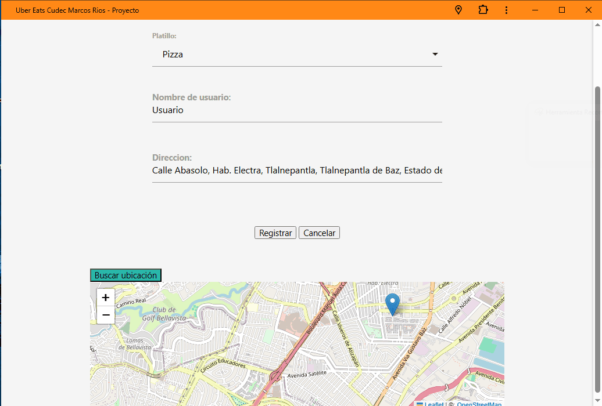
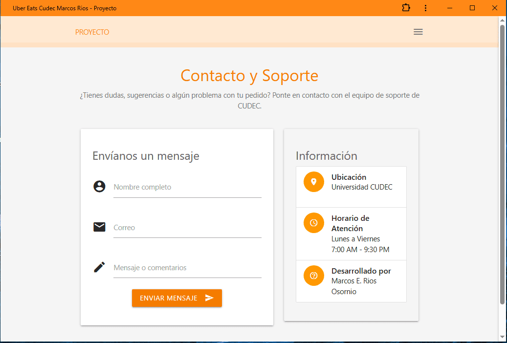

# Uber Eats CUDEC

**Tipo de aplicación:** Progressive Web App (PWA)  
**Descripción:** Aplicación web progresiva orientada a la consulta, gestión y administración de pedidos del menú gastronómico universitario de CUDEC.  
**Materia:** Inteligencia Artificial / Diseño y Evaluación de Proyectos  
**Carrera:** Ingeniería en Sistemas / Licenciatura  
**Alumno:** Marcos Emiliano Rios Osornio  

---

## 2. Descripción del proyecto
**Uber Eats CUDEC** es una solución digital diseñada para modernizar la experiencia gastronómica dentro del entorno universitario. La plataforma resuelve el desorden y la ineficiencia de las comandas manuales al centralizar la consulta de platillos, precios e ingredientes en un catálogo interactivo en tiempo real. 

Está orientada a dos tipos de usuarios:
* **Estudiantes y personal docente/administrativo:** Quienes consultan el menú, precios y realizan pedidos.
* **Administradores de cafetería:** Quienes pueden gestionar la carta, registrar nuevos platillos y capturar fotografías del alimento al instante desde la cámara.

Su propósito es ofrecer una plataforma accesible, rápida e instalable que conserve funcionalidades de consulta incluso con conexiones a internet lentas o inestables.

---

## 3. Objetivos

### Objetivo general
Desarrollar e implementar una Aplicación Web Progresiva (PWA) instalable para la consulta y administración eficiente del menú gastronómico universitario de CUDEC, integrando sincronización de datos en tiempo real y soporte offline.

### Objetivos específicos
* Implementar un Service Worker (`sw.js`) con estrategias de almacenamiento en caché para garantizar la navegabilidad e instalabilidad del sistema.
* Integrar la base de datos NoSQL Firebase Firestore para la lectura y persistencia de platillos en tiempo real.
* Configurar la API de la cámara del dispositivo (`getUserMedia`) para la captura e inclusión inmediata de imágenes de platillos.
* Diseñar una interfaz limpia, responsive e intuitiva utilizando el framework Materialize CSS.

---

## 4. Características principales
* **Modo PWA Instalable:** Compatible con navegadores móviles y de escritorio mediante `manifest.json`.
* **Soporte Offline:** Caché de archivos estáticos (HTML, CSS, JS) administrado por Service Worker.
* **Catálogo en tiempo real:** Carga de platillos, ingredientes y precios sincronizados con Firebase.
* **Captura fotográfica:** Modulo web para abrir la cámara del dispositivo, tomar fotos de nuevos platillos y procesarlas en formato Canvas/DataURL.
* **Menú Responsive:** Navegación optimizada para móviles con barra lateral interactiva (*Sidenav*).

---

## 5. Tecnologías utilizadas
* **Frontend:** HTML5, CSS3, JavaScript (ES6+).
* **Framework CSS:** Materialize CSS v1.0.0.
* **PWA Engine:** Service Workers API, Web App Manifest.
* **Backend / Database:** Google Firebase v6.0.1 (Firestore Database).
* **Control de versiones y Hosting:** Git, GitHub Pages.

---

## 6. Estructura del proyecto

```text
UberEatsCudecMarcosRlos/
├── css/
│   ├── materialize.min.css
│   └── styles.css
├── js/
│   ├── db.js
│   ├── firebase.js
│   ├── index.js
│   └── materialize.min.js
├── iconos/
│   ├── icon-192x192.png
│   ├── icon-192x192-maskable.png
│   ├── icon-512x512.png
│   └── icon-512x512-maskable.png
├── pages/
│   ├── about.html
│   ├── contact.html
│   └── pedidos.html
├── index.html
├── manifest.json
├── sw.js
└── README.md
```
---
## 7. Evidencias / Capturas de pantalla






---

## 8. Base de datos

* **Motor utilizado:** Cloud Firestore (Firebase) — Base de datos NoSQL basada en documentos y colecciones en tiempo real.
* **Colecciones principales:** 
  * `recipes` / `platillos`
    * `nombre` *(string)*: Nombre del platillo o alimento.
    * `ingredientes` *(string)*: Insumos o descripción de la receta.
    * `precio` *(string / number)*: Costo asignado al platillo.
    * `fotoFinal` *(string)*: Imagen en formato Base64 (DataURL) capturada mediante la cámara.

---

## 9. Licencia

Este proyecto fue desarrollado con fines exclusivamente académicos como parte de los estudios universitarios en Universidad CUDEC. Queda reservado su uso para evaluación y aprendizaje dentro del plan curricular.
